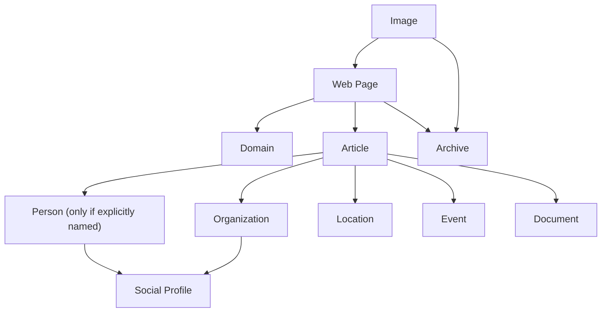

# Image Intelligence & OSINT Investigation Platform — Architecture

**Revision 2.** Supersedes Revision 1 (image-search framing). This is an
amendment to Phase 1, not a restart: the evidence model, source-independence
logic, provider abstraction and compliance boundary from R1 all survive and are
extended. Sections marked **[R2]** are new or materially changed.

Companion documents: [DATA_MODEL.md](DATA_MODEL.md) ·
[API.md](API.md) · [ROADMAP.md](ROADMAP.md)

---

## 1. Mission

An **Image Intelligence & OSINT Investigation Platform**. An uploaded image is
the *entry point* to a structured public-information investigation, not the
product. The platform discovers, organizes, correlates and presents publicly
available evidence, and preserves the chain from every displayed statement back
to the page it came from.

**[R2] The unit of work is the investigation, not the upload.** Investigations
are persistent, resumable, and accumulate evidence across many images, many
discovery runs, and human annotation over time. This single change drives most
of the revisions below.

### 1.1 The prohibition

Unchanged from R1 and non-negotiable. The system must never identify a person
from facial features, compare faces to determine identity, rank people by facial
similarity, build a biometric database, or infer identity from biometric
information.

| Prohibited | Reason |
|---|---|
| Face embedding / descriptor extraction | Creates biometric data (GDPR Art. 9) |
| Face-to-face similarity comparison | Biometric identification |
| Face index or gallery of any size | EU AI Act Art. 5(1)(e) if web-sourced |
| Ranking people by facial similarity | Biometric identification |
| Inferring identity from a face | The core prohibition |

**Identity information may only be reported when explicitly published on a
discovered public webpage, with source attribution.** The system reports "this
page states the person pictured is X", never "this is X". Enforced in the data
model (§7), not in documentation. All image comparison is **non-biometric**:
cryptographic and perceptual hashing over file content only (§8).

### 1.2 Honest limits, stated in the UI

- An image never published online returns nothing. There is no index of
  unpublished images and lawfully cannot be one.
- Recall is bounded by the providers. What they have not crawled cannot be found.
- A name on a page is a **claim by that page** — pages are stale, miscaptioned,
  syndicated, and occasionally false.
- **[R2]** Domain classification is descriptive, never evaluative. `.gov` means
  the domain is governmental. It does not mean the page is true.

---

## 2. Primary design principle: evidence-first

Every statement, entity, relationship and timeline event links to one or more
supporting observations. **The system never outputs an unsupported conclusion.**

Every finding must answer five questions, and each has a designated home in the
schema rather than being reconstructed at render time:

| Question | Answered by |
|---|---|
| Where did this come from? | `observations.page_id` → `pages.url` |
| Which pages support it? | `fact_evidence` join |
| When was it observed? | `observations.extracted_at`, `pages.fetched_at` |
| How many independent sources? | `facts.independent_source_count` (§9.3) |
| Are there conflicting sources? | `facts.status = CONFLICTED` (§10) |

**[R2] Architectural priority order.** When a trade-off arises, prefer in this
order: evidence traceability → explainability → investigator workflow →
reproducibility → extensibility → maintainability → performance → responsible
handling. Faster or simpler loses to traceable and reproducible. This ordering
is binding on all later phases.

---

## 3. Deployment topology

**[R2] Local-first, single-user, Docker Compose**, with a documented path to
multi-user. No distributed complexity that a single investigator does not need.

```
┌──────────────┐      ┌──────────────┐      ┌──────────────┐
│ iMATCH       │─────▶│     api      │─────▶│    worker    │
│ workspace    │ SSE  │  (FastAPI)   │ arq  │  (arq pool + │
│ (via proxy)  │      │              │      │   scheduler) │
└──────────────┘      └──────┬───────┘      └──────┬───────┘
                             │                      │
               ┌─────────────┼──────────────────────┤
               ▼             ▼                      ▼
         ┌──────────┐  ┌──────────┐         ┌──────────────┐
         │ Postgres │  │  Redis   │         │   MinIO/S3   │
         │  (+ FTS, │  │ queue +  │         │ screenshots, │
         │   graph) │  │ pub/sub  │         │ HTML, images │
         └──────────┘  └──────────┘         └──────────────┘
```

Two deployables, as in R1: **api** (HTTP only, never long work in a request) and
**worker** (owns Playwright, Tesseract, spaCy — hence a ~2 GB image against the
api's ~200 MB). **[R2]** The worker now also runs the **scheduler** for image
monitoring sweeps (§13).

### 3.1 Single-user now, multi-user later

Every ownership-scoped table carries `owner_id` from day one, defaulted to a
single local user. Multi-user later is a policy change plus auth middleware, not
a schema migration. This costs one nullable column now and saves a rewrite later,
which the priority order in §2 requires.

### 3.2 Why not a graph database **[R2]**

The relationship graph (§11) is modelled in **Postgres**, not Neo4j.

An investigation graph is thousands of nodes, not billions. Postgres recursive
CTEs traverse that in milliseconds. Adding Neo4j would introduce a second
datastore, a second query language, a synchronisation problem between evidence
and graph, and a second backup path — all so that one service could do what
`WITH RECURSIVE` already does. It also directly violates "do not introduce
unnecessary distributed complexity".

**Revisit trigger:** cross-investigation graph queries spanning millions of
nodes, or traversals deeper than six hops becoming routine.

### 3.3 No frontend of its own **[R4]**

IIE renders inside the **existing NexGen iMATCH investigator workspace**, not in
a separate application. A second app would mean a second login against a second
origin — precisely the cross-site configuration that broke every earlier iMATCH
deployment, where `VITE_IMATCH_API_BASE`, CSP `connect-src`, CORS origins and
cookie `SameSite` all had to agree.

The workspace therefore reaches IIE through a **proxy in `imatch_api`**: the
browser talks to one origin under one session, while IIE keeps its own database
and stays independently deployable and testable.

---

## 4. Module map **[R2]**

```
image-intelligence-engine/
├── api/                  # FastAPI: routers, DI, middleware, SSE, OpenAPI
├── worker/               # arq pool, stage orchestrator, scheduler
├── workspace/        [R2]# investigations, notes, bookmarks, activity log
├── crawler/              # hardened fetch, robots, politeness, render, snapshot
├── providers/        [R2]# plugin host + adapters (google, bing, tineye,
│                         #   wayback, reddit, custom)
├── image_discovery/      # discovery orchestration, pHash provenance classify
├── page_processing/      # HTML→structured, OCR, screenshots, domain classify
├── entity_extraction/    # NER, validators, structured data, claim building
├── correlation/          # entity resolution, fact merging, dedup clustering
├── confidence/       [R2]# deterministic scoring + explanation objects
├── graph/            [R2]# relationship graph build + traversal
├── timeline/         [R2]# timeline engine
├── monitoring/       [R2]# image watch, sweeps, change detection
├── copilot/          [R2]# non-decisional assistant, citation enforcement
├── search/           [R2]# unified search across all object types
├── reports/              # HTML / PDF / JSON / Markdown
├── database/             # SQLAlchemy models, repositories, Alembic
├── shared/               # domain types, config, logging, metrics, errors, ports
├── tests/                # unit, integration, architecture
└── docs/
```

Seven new modules, each earning its place by owning one clearly bounded concern
that would otherwise smear across the pipeline.

### 4.1 Clean Architecture layering

Unchanged. Four layers, dependencies inward only.

| Layer | Contents | May import |
|---|---|---|
| **Domain** | Entities, value objects, confidence rules, provenance rules | stdlib + pydantic |
| **Application** | Use cases, stage orchestration, ports (Protocols) | domain |
| **Infrastructure** | Repositories, HTTP, provider adapters, OCR, LLM, store | domain, application |
| **Interface** | FastAPI routers, CLI | all |

**[R2]** Confidence scoring (§9) and provenance classification (§8) live in
**domain**. They are the rules most likely to be challenged in a report, and they
must be testable with zero infrastructure and reproducible from stored data alone.

### 4.2 Enforced boundaries

An architecture test parses the import graph and fails the build on: domain
importing outward, inner importing outer, cross-module imports bypassing a
declared port, and **any import of a face-recognition library anywhere** (§14).

---

## 5. The investigation workspace **[R2]**

The organising abstraction. Everything belongs to an investigation.

```
Investigation (Case)
├── Images            uploaded probes + every discovered image
├── Evidence          observations, facts, confidence explanations
├── Sources           pages, domains, content clusters
├── Graph             nodes and evidence-backed edges
├── Timeline          chronological events with evidence links
├── Notes             human annotation, tags, attachments, checklists
├── Bookmarks         flagged pages, facts, entities, images
├── Monitors          watch schedules and their change history
├── Reports           generated artifacts, content-hashed
└── Activity Log      immutable, hash-chained audit trail
```

**Resumability** is a first-class property. An investigation is a durable state
machine: every pipeline stage persists its own row (`status`, counters, error),
so a crash, a restart, or an operator pausing for a week resumes at the stage
boundary. A stage-6 failure never re-runs the paid discovery call from stage 2.

**[R2] Human input never mutates machine evidence.** Notes, tags and bookmarks
live in separate tables. `observations` and `facts` carry
`origin ∈ {EXTRACTED, HUMAN}` and **no code path writes `HUMAN` rows into
extracted-evidence tables** — enforced by a repository-level invariant and a
test. An investigator's hypothesis must never become indistinguishable from a
crawled fact six months later when the report is challenged.

---

## 6. Core pipeline

Staged, persisted, resumable. **[R2]** adds stages 6, 11, 12 and 13.

| # | Stage | Output | Failure policy |
|---|---|---|---|
| 1 | `INGEST` | Image stored; SHA256, pHash/dHash/wHash, EXIF, dimensions | fatal |
| 2 | `DISCOVER` | Candidate appearances from enabled provider plugins | fatal if all fail |
| 3 | `VERIFY` | Fetch candidate images; classify provenance by hash | per-item |
| 4 | `CRAWL` | Fetch page, render, screenshot, HTML snapshot | per-item |
| 5 | `PARSE` | Structured content, metadata, captions, nearby text, outlinks | per-item |
| 6 | `CLASSIFY_DOMAIN` **[R2]** | Domain category + metadata | per-item |
| 7 | `OCR` | Text from discovered images | per-item, optional |
| 8 | `EXTRACT` | Observations with offsets, method, extractor version | per-item |
| 9 | `CLUSTER` | Duplicate-content clusters, copy relationships | fatal |
| 10 | `CORRELATE` | Resolved entities, merged facts, status | fatal |
| 11 | `SCORE` **[R2]** | Deterministic confidence + explanation objects | fatal |
| 12 | `GRAPH` **[R2]** | Nodes and evidence-backed edges | fatal |
| 13 | `TIMELINE` **[R2]** | Chronological events with evidence links | fatal |
| 14 | `SUMMARIZE` | Copilot narrative over extracted facts only | degradable |
| 15 | `REPORT` | HTML / PDF / JSON / Markdown | degradable |

**Per-item**: one bad page never fails the batch; it is recorded as that item's
error and the rest continue. **Degradable**: the stage may fail and the
investigation still completes with a flag — **the LLM is never on the critical
path for evidence.** If the model is unavailable the report ships without prose
and with every fact, citation and confidence explanation intact.

Ordering note: `SCORE` follows `CLUSTER`, because independence cannot be
computed until duplicate content is collapsed (§9.3).

---

## 7. Evidence model

Four concepts, deliberately not collapsed:

```mermaid
graph LR
  P[Page] --> O[Observation]
  O --> M[Mention]
  M --> E[Entity]
  O --> F[Fact]
  E --> F
  F -.supported by 1..n.-> O
```

- **Observation** — one immutable extraction event: this string, at these
  offsets, on this page, by this method, with this extractor version, at this
  time. The atom of the system.
- **Mention** — a surface form recognised as referring to something.
- **Entity** — a resolved canonical thing. Mutable and **re-derivable**.
- **Fact** — an assertion about an entity, supported by observations.

**Recomputability** is why these are separate. When correlation or scoring
improves, stages 9–13 re-run over stored observations: no re-crawling, no new API
spend, and old reports remain reproducible because `extractor_version` records
which logic produced each observation.

**[R2] Evidence Explorer contract.** Every fact in the UI expands to its full
chain — Fact → Observation(s) → Page → Screenshot → HTML snapshot → Timestamp →
Source URL — with no black-box steps. This is an API guarantee
(`GET /facts/{id}/evidence-chain`), not a UI feature, so every consumer inherits
it.

---

## 8. Image evidence and provenance **[R2]**

Every **discovered** image becomes an evidence object in its own right, not just
the uploaded probe. Tracked: SHA256, pHash/dHash/wHash, dimensions, file size,
MIME type, EXIF, discovery date, first seen, last seen, source page, archive URL,
download timestamp, storage key.

### 8.1 Provenance relationships

Images relate to one another through a typed, directed edge with a stored
justification:

| Relationship | Test |
|---|---|
| `EXACT_COPY` | SHA256 identical |
| `RESIZED_COPY` | pHash Hamming ≤ 6, aspect ratio within tolerance, different dimensions |
| `COMPRESSED_COPY` | pHash Hamming ≤ 8, same dimensions, different SHA256 |
| `CROPPED_COPY` | pHash distant, region-match confirmed by dHash sub-region scan |
| `MIRRORED_COPY` | pHash of horizontally flipped probe ≤ 6 |
| `NEAR_DUPLICATE` | pHash Hamming ≤ 12, none of the above |
| `THUMBNAIL` | near-duplicate with substantially smaller dimensions |
| `UNVERIFIED` | provider asserted it; local fetch failed |
| `REJECTED` | pHash Hamming > 12 — provider was wrong; excluded from findings |

**Non-biometric by construction.** Every test above operates on file content —
cryptographic hash, perceptual hash, dimensions. None inspects faces, and no
model with facial semantics exists in the dependency graph (§14).

**Providers are not trusted.** Stage 3 fetches each candidate and classifies it
locally, so every finding carries a reproducible justification rather than "the
provider said so", and provider false positives are actively rejected. Thresholds
are configuration, calibrated in Phase 8 against a labelled fixture set and
recorded with their measurement — no unmeasured magic numbers.

---

## 9. Confidence **[R2]**

### 9.1 Deterministic, never AI-guessed

Confidence is computed by a **pure function in the domain layer** from stored
counts. The same evidence always yields the same score, on any machine, at any
time. An LLM may *narrate* an explanation but may never produce or alter a value.

### 9.2 Factors and explanation

`SCORE` emits a structured `ConfidenceExplanation` — a list of factor
contributions, persisted alongside the value:

| Factor | Effect |
|---|---|
| Independent domains | primary positive driver |
| Supporting observations | positive, with diminishing returns |
| Source agreement | positive when sources concur on the value |
| Freshness | recent corroboration positive; only-stale sources negative |
| Archived copies | positive — an archived copy is durable, verifiable evidence |
| Contradictions | strong negative; forces `CONFLICTED` |
| Extraction method strength | structured (schema.org) > declared meta > inferred > OCR |

```jsonc
{
  "value": "MEDIUM",
  "score": 0.58,
  "factors": [
    { "factor": "independent_domains", "observed": 2, "contribution": +0.30,
      "why": "Asserted by 2 unrelated registrable domains" },
    { "factor": "extraction_method",   "observed": "schema_person", "contribution": +0.20,
      "why": "One source published this as machine-readable schema.org data" },
    { "factor": "archived_copies",     "observed": 1, "contribution": +0.08,
      "why": "One appearance has a Wayback snapshot" },
    { "factor": "freshness",           "observed": "412d", "contribution": -0.00,
      "why": "Most recent corroboration is 412 days old" }
  ],
  "ceiling_reason": null
}
```

Every confidence value carries this object. **A number without an explanation is
never displayed** — the API returns them together or not at all.

### 9.3 Independence is the subtle part

Naive source counting is wrong in three ways, all handled:

1. **Syndication.** Forty outlets republishing one wire story is *one*
   journalistic source. Collapsed via content-cluster membership (§10).
2. **Same operator.** `example.com` and `blog.example.com` are one source.
   Collapsed by registrable domain (eTLD+1, public suffix list).
3. **Circular citation.** C cites B who copied A. Partly detectable via
   first-seen dates; where undetectable, **disclosed as a known limitation** in
   the explanation rather than papered over.

```
independent_source_count =
    count(distinct registrable_domain)
    over observations, after collapsing each content cluster to its ORIGINAL
```

**[R2] Domain classification never feeds confidence.** A `.gov` domain is not
scored as more truthful than a blog. Classification is metadata for filtering and
context only. Encoding institutional trust into an evidence score would smuggle
an editorial judgement into a number presented as objective.

---

## 10. Facts, contradiction and content clustering **[R2]**

### 10.1 Fact status

| Status | Meaning |
|---|---|
| `COMMON` | ≥2 independent sources agree |
| `UNIQUE` | exactly one source; shown with source, reason, confidence |
| `CONFLICTED` | sources disagree |
| `UNKNOWN` | extracted but unresolvable — ambiguous, or insufficient signal |

**Never silently choose between conflicting values.** All variants are preserved
with their own evidence chains and displayed side by side. The investigator
adjudicates; a tool that picks a winner is hiding evidence. `UNKNOWN` exists so
that unresolvable extractions are visibly retained rather than dropped — dropping
them would be a silent, invisible loss.

### 10.2 Duplicate content clustering

Pages that copy each other are clustered, with a typed role:

| Role | Detection |
|---|---|
| `ORIGINAL` | earliest first-seen in the cluster |
| `REPOST` | high simhash similarity, later date, different domain |
| `MIRROR` | near-identical including structure, often different TLD |
| `TRANSLATION` | different detected language, high cross-lingual similarity |
| `PARTIAL_COPY` | substantial shared passages, additional original content |
| `MODIFIED_COPY` | high similarity with material alterations |

Simhash over normalised main text does the heavy lifting. **Translation
detection is explicitly best-effort** — language detection plus cross-lingual
similarity, with LLM adjudication on borderline pairs. It is labelled
lower-confidence in the UI because it is the least reliable classification here,
and overstating it would corrupt independence counting.

This directly reduces duplicate evidence *and* feeds §9.3.

---

## 11. Relationship graph **[R2]**



Modelled as `graph_nodes` + `graph_edges` in Postgres (§3.2), rebuilt
deterministically by stage 12 from evidence.

**Every edge is evidence-backed.** `graph_edges` carries a non-null
`evidence_observation_ids` array and a `derivation` describing the rule that
created it. An edge with no supporting observation cannot be inserted — enforced
by a database constraint, not convention. This is what makes the graph a view
over evidence rather than a second, drifting source of truth.

`Person` nodes are created **only** from explicitly published names, and carry
`asserted_by_page_id`. There is no inference path from an image to a person.

---

## 12. Timeline engine **[R2]**

Its own subsystem, because timeline events come from six different sources and
that reconciliation deserves one owner.

Event kinds: image first appearance, latest appearance, archive snapshot, news
publication, website update, page removal detected, **and investigation actions**
(upload, discovery run, report generated) so the case history and the world's
history sit on one axis.

Every event carries:

- `occurred_at` plus **`precision` ∈ {exact, day, month, year, inferred}**
- a link to the supporting observation or page

Rendering an inferred date as though it were exact would be a lie of formatting,
so precision is stored and the UI renders accordingly ("2019" not
"1 Jan 2019 00:00").

---

## 13. Image monitoring **[R2]**

Investigators watch an image over time. Scheduled sweeps re-run discovery and
diff against prior state.

Detected changes: `NEW_APPEARANCE`, `PAGE_REMOVED`, `PAGE_UPDATED`,
`IMAGE_REPLACED`, `ARCHIVE_ADDED`.

**The critical subtlety: removal must be distinguished from unobservability.**
A 404 or 410 is evidence of removal. A 403, 429, timeout, or robots.txt change is
**not** — it is a page we can no longer observe, which is a different fact
entirely. Conflating them would fabricate an event ("the page was taken down")
from an absence of information. Modelled as distinct outcomes, and a removal is
only asserted after N consecutive confirming sweeps.

Every change extends the investigation timeline with its own evidence.

---

## 14. Compliance by construction

1. **No face library may enter the dependency graph.** CI fails the build if
   `insightface`, `face_recognition`, `dlib`, `facenet`, `deepface`, `arcface`,
   or `mtcnn` appear in the lockfile.
2. **Architecture test** asserts no module imports them, catching transitive
   pull-ins.
3. **No embedding storage exists** — no vector column, no vector index, no ANN
   dependency. A face gallery has nowhere to live.
4. **Optional face detection for redaction only** — boxes used to blur, then
   discarded; no descriptors, no persistence. Default **off**.
5. **License plates default off** — personal data in the EU and several Indian
   contexts. `IIE_ENABLE_PLATE_EXTRACTION=false`.
6. **Lawful basis required** per investigation, recorded in the hash-chained
   audit log — **including on refused actions**, so "why was this looked at" is
   answerable for attempts, not only successes.
7. **[R2] Person nodes require an explicit published assertion** with a source
   page id. Database constraint, not convention.

---

## 15. Provider plugin system **[R2]**

R1 had a single `ImageDiscoveryProvider` port. That was too narrow: Wayback is an
archive lookup, Reddit is a content source, and neither is an image-discovery
provider. Forcing them through one interface would have produced adapters that
implement half a contract and raise `NotImplementedError` for the rest.

**Capability-declaring plugins.** Each provider declares what it can do:

```python
class ProviderCapability(StrEnum):
    IMAGE_DISCOVERY = "image_discovery"   # google, bing, tineye
    ARCHIVE_LOOKUP  = "archive_lookup"    # wayback
    CONTENT_SOURCE  = "content_source"    # reddit
    PAGE_METADATA   = "page_metadata"
```

A plugin supplies a manifest (name, capabilities, config schema, rate limits,
cost profile) and implements only the protocols for its declared capabilities.
The registry discovers plugins by entry point and validates the manifest at
startup. **Adding a provider requires no change outside its own directory** —
enforced by an architecture test asserting no module imports a concrete provider
package.

Unconfigured, failing, and empty-result providers are **reported distinctly**.
"No matches" and "no API key" lead to opposite next steps, and conflating them
puts a false negative into a report.

---

## 16. Investigation copilot **[R2]**

A **non-decisional** assistant. It may summarize findings, identify
contradictions, highlight unusual observations, suggest follow-up searches,
explain why a fact's evidence is strong or weak, and recommend next steps.

It may **never** identify unknown people, assert a fact absent from the evidence
store, or alter a confidence value.

**Enforcement is structural, not prompt-based:**

1. **Read-only, evidence-scoped tools.** The copilot's only data access is a
   fixed set of read-only queries scoped to the current investigation. It cannot
   reach the open web, and it has no write path.
2. **Citation requirement.** Every claim-bearing sentence must carry one or more
   evidence ids.
3. **Post-generation validation.** Output is parsed and each cited id verified to
   exist and to support the claim's subject. Sentences failing validation are
   **rejected, not silently rendered**.
4. **No confidence authorship.** Values come from §9. The copilot may render the
   stored explanation into prose; the numbers are not its to produce.

Prompt instructions alone would be a suggestion. A validator is a control.

Model default: Claude — `claude-sonnet-5` for high-volume normalization and
adjudication, `claude-opus-5` for report prose and copilot reasoning.

### 16.1 Explainability everywhere

Every AI-generated summary, relationship or recommendation ships with a
**"Why?"** payload referencing supporting evidence. This is an API contract:
endpoints returning AI-derived content return `explanation` alongside, and the UI
surfaces it inline. Content without an explanation is a bug, not a degraded mode.

---

## 17. Search **[R2]**

Unified search across cases, images, domains, pages, organizations, people
(explicitly-mentioned only), events, OCR text, reports, notes and evidence.

Postgres-native — no Elasticsearch until measurement justifies the second
datastore:

- A `search_documents` table with a `tsvector` column, one row per searchable
  object, populated by triggers on write. One index serves every type, and
  ranking is comparable across types.
- `pg_trgm` for fuzzy name matching; btree for domain, case id, date ranges.
- pHash search via **BK-tree** (in-process, rebuilt on demand) for bounded
  Hamming-distance lookup; SHA256 exact via btree.

**Person search resolves only against names explicitly published in collected
sources.** It searches quoted page content, not people.

---

## 18. Cross-cutting concerns

- **API-first [R2]** — every capability is a documented REST endpoint. The
  frontend is purely a client with no privileged path, which is what keeps future
  integrations (including NexGen) from requiring core refactors. Enforced by an
  architecture test: no business logic in routers.
- **Audit trail [R2]** — hash-chained, append-only, immutable. Every action
  logged: image uploaded, discovery started, page crawled, OCR completed, fact
  extracted, report generated, timeline updated, note created, monitor triggered.
  `verify()` re-walks the chain and reports the first break.
- **Config** — pydantic-settings, `IIE_` prefix, typed, validated at startup;
  restrictive defaults, widening is opt-in.
- **Logging** — structlog, JSON, `investigation_id` + `stage` bound to context.
- **Metrics** — Prometheus: stage duration, per-provider latency and error rate,
  pages/sec, queue depth, LLM tokens and cost per investigation.
- **Errors** — typed hierarchy per module so retry logic can differ by class.
- **Retries** — tenacity, exponential backoff with jitter, idempotent operations
  only; never retry a 4xx or a paid call that already succeeded.
- **Politeness** — per-registrable-domain rate limits and concurrency caps,
  robots.txt respected, honest User-Agent. Getting IIE blocked from a major site
  damages every future investigation.
- **Retention** — `retention_expires_at` per investigation, scheduled purge, and
  a documented subject-access export path.

---

## 19. Technology stack

| Concern | Choice | Rationale |
|---|---|---|
| Language | Python 3.12 | brief; OSINT/NLP ecosystem |
| API | FastAPI + Pydantic v2 | async-native, schema-first, OpenAPI for §18 |
| ORM | SQLAlchemy 2.0 async + asyncpg | typed 2.0 style |
| Migrations | Alembic | brief |
| DB | PostgreSQL 16 | relational + JSONB + FTS + recursive CTE graph |
| Cache/queue/pubsub | Redis 7 | one dependency, three jobs |
| Jobs + scheduler | arq | asyncio-native; cron support for §13 |
| Object store | MinIO (dev) / S3 (prod) | screenshots and HTML do not belong in Postgres |
| Fetching | httpx | async; hardened fetcher already built on it |
| Rendering | Playwright (Chromium) | JS-heavy pages; worker image only |
| Image hashing | Pillow + imagehash | pHash/dHash/wHash |
| OCR | Tesseract (pluggable) | PaddleOCR as documented upgrade |
| NER | spaCy `en_core_web_lg` | offline, fast, no per-call cost |
| Structured data | extruct | JSON-LD + microdata + RDFa in one pass |
| Simhash | `simhash` / custom | duplicate clustering (§10.2) |
| Language ID | `langdetect` / `fasttext` | translation detection |
| Phones | phonenumbers | E.164 normalization + validity |
| Domains | tldextract | public suffix list, independence scoring |
| PDF | WeasyPrint | HTML→PDF, one template serves both |
| Frontend | **None of its own.** Surfaces inside the existing NexGen iMATCH investigator workspace (React + Vite) — see §3.3 |
| Graph UI | Cytoscape.js | dense entity graphs |
| Editor | TipTap | rich-text notes (§5) |
| Containers | Docker + Compose | local-first |

---

## 20. Revision log — what changed and why

| # | Change | Why it improves the platform |
|---|---|---|
| 1 | Investigations as the central persistent abstraction | Real OSINT work spans days and many images. One-shot uploads discard context between runs and make findings unciteable later. |
| 2 | Every discovered image is an evidence object with provenance edges | The relationship *between* copies is itself evidence — a cropped repost dated after the original is a finding, not noise. |
| 3 | Relationship graph in Postgres, evidence-backed edges, DB-enforced | Makes "how are these connected" answerable; the constraint stops the graph drifting into an unsourced second truth. |
| 4 | Timeline promoted to a subsystem with date `precision` | Six sources of dates need one reconciler; precision prevents inferred dates rendering as facts. |
| 5 | Deterministic confidence + persisted explanation objects | Reproducible, defensible, and never an AI guess. Same evidence, same number, forever. |
| 6 | `UNKNOWN` added; `DISTINCT`→`UNIQUE` | Unresolvable extractions stay visible instead of being silently dropped. |
| 7 | Domain classification stored but barred from confidence | Prevents smuggling institutional trust into a number presented as objective. |
| 8 | Duplicate clustering with typed copy roles | Cuts duplicate evidence and is a prerequisite for honest independence counts. |
| 9 | Source Explorer + Evidence Explorer as **API** contracts | Traceability becomes a platform guarantee every client inherits, not a UI feature one screen implements. |
| 10 | Notebook strictly separated from extracted evidence | A hypothesis must never become indistinguishable from a crawled fact under challenge. |
| 11 | Monitoring, with removal vs unobservability separated | Turns a snapshot into longitudinal evidence without fabricating takedown events from 403s. |
| 12 | API-first, no privileged frontend path | Future integrations need no core refactor. |
| 13 | Capability-declaring provider plugins | Wayback and Reddit are not image-discovery providers; one interface would have forced half-implemented adapters. |
| 14 | Copilot constrained by read-only tools + citation validation | Prompt instructions are suggestions; a validator is a control. |
| 15 | Unified `search_documents` FTS table | One index, comparable ranking across every object type, no second datastore. |
| 16 | Single-user now, `owner_id` everywhere | Multi-user later costs middleware, not a migration. |
| 17 | Graph in Postgres rather than Neo4j | Avoids a second datastore, query language and sync problem for thousands of nodes. |
| 18 | Priority order binding on later phases | Trade-offs get resolved consistently instead of per-developer taste. |

### Carried forward unchanged from R1

Source-independence logic, the four-concept evidence model, non-trusted provider
verification, the compliance boundary, per-item failure isolation, and the
reusable components from `nexgen-itrace` (hardened fetcher, HTML/JSON-LD
extractor, claim extraction with source ranking, hash-chained audit log, Google
Vision and TinEye adapters — the latter two now repackaged as plugins).
