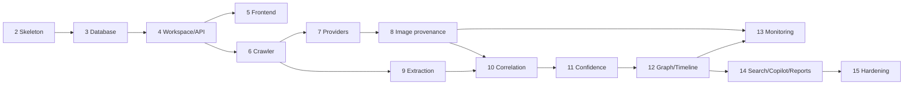

# Implementation Roadmap — Revision 2

Companion to [ARCHITECTURE.md](ARCHITECTURE.md) ·
[DATA_MODEL.md](DATA_MODEL.md) · [API.md](API.md)

R1 had 11 phases. R2 adds seven modules (workspace, confidence, graph, timeline,
monitoring, copilot, search) and reframes the product around persistent
investigations. Rather than inflate every phase, the plan is **restructured into
15 phases**, ordered so that each one ends with something that builds, runs, and
can be demonstrated.

**Ordering principle.** Evidence infrastructure comes before intelligence
features. Confidence, graph and timeline all read from `observations`, so
observations must be correct and stable first. Building the copilot before the
evidence store is solid would mean an assistant reasoning over data whose shape
is still moving.

Every phase ends with: architectural decisions explained, code that builds and
runs, tests passing, and an **approval checkpoint** before the next begins.

---

## Phase 1 — Architecture ✅

**Status: complete (Revision 2).** ARCHITECTURE.md, DATA_MODEL.md, API.md,
ROADMAP.md.

---

## Phase 2 — Skeleton and infrastructure

Folder structure per ARCHITECTURE §4, `shared/` (config, logging, metrics, error
hierarchy, port protocols), Docker Compose (api, worker, postgres, redis, minio,
frontend), CI with the **face-library lockfile guard** and the architecture test
harness in place from the very first commit.

**Done when:** `docker compose up` brings every service up healthy;
`/api/v1/health` responds; the architecture test runs green in CI.

Guards go in first deliberately — a boundary added after the code it constrains
is a boundary already crossed.

---

## Phase 3 — Database foundation ✅

All tables from DATA_MODEL.md, Alembic migrations with tested downgrades, the
five database-level invariants, repository layer, and `REVOKE UPDATE, DELETE` on
`audit_log`.

**Status: complete.** 42 tables, 2 migrations (up → down → up verified,
`alembic check` clean), 103 tests. Each invariant has a test that writes the
forbidden row *directly through SQLAlchemy*, bypassing the repository layer, and
asserts the database refuses it — because these guarantees must hold against a
buggy service or a psql prompt, not merely against well-behaved code.

An invariant that has never been observed failing is an assumption.

---

## Phase 4 — Workspace and API core ✅

Auth (JWT, bcrypt), investigation CRUD, lawful-basis enforcement, hash-chained
audit log with `verify()`, pipeline run/stage state machine, SSE progress
channel, OpenAPI.

**Status: complete.** 143 tests, 25 endpoints. A case runs its whole lifecycle
through the API alone — created, run started, paused, resumed, moved through
review to COMPLETED and ARCHIVED — with the audit chain verifying at the end.

Preconditions were added on top of the transition table: `UNDER_REVIEW` requires
a completed run, `COMPLETED` requires an empty review queue, and
`DELETED_PENDING_RETENTION` is refused while a hold is active. Every blocked
transition is audited with the rule that failed.

---

## Phase 5 — iMATCH workspace integration

**Revised.** IIE gets no frontend of its own. It surfaces inside the existing
NexGen iMATCH investigator workspace, reached through a proxy in `imatch_api` so
the browser stays on one origin with one session (ARCHITECTURE §3.3).

* Proxy routes in `imatch_api`, reusing its existing auth dependency
* `frontend/src/services/provenanceApi.js` in the iMATCH repo
* `frontend/src/workspace/ProvenancePage.jsx`, in the workspace's own styling
* Nav entry, route, and a "Trace this image" handoff from **Face search** that
  carries the probe across without a re-upload

**Done when:** an investigator on `/workspace/search` can hand a probe to the
provenance page, watch stage progress live, and never see a second login.

Backend delivered ahead of this phase: image ingest (SHA256, pHash/dHash/wHash,
EXIF, GPS flagging), upload endpoint with custody chain, and content-addressed
object storage.

---

## Phase 6 — Crawler

Async port of the hardened fetcher from `nexgen-itrace`, robots.txt, per-domain
politeness and concurrency caps, Playwright rendering, screenshot and HTML
snapshot capture to object store, retry policy.

**Done when:** the full SSRF suite passes (private ranges, IPv4-mapped/6to4/
Teredo unwrapping, per-hop redirect revalidation, byte caps); a live fetch of a
public page produces a screenshot and HTML snapshot; politeness limits are
demonstrably enforced.

---

## Phase 7 — Provider plugin system

Plugin host, manifest validation, capability registry, entry-point discovery.
Adapters: `google` (Vision web detection), `tineye`, `wayback`, `manual`. `bing`
and `reddit` scaffolded.

**Done when:** `GET /providers` reports configured / unconfigured / failing
distinctly; a new provider can be added **without touching any file outside its
own directory**, proven by an architecture test.

---

## Phase 8 — Image evidence and provenance

Ingest (SHA256, pHash/dHash/wHash, EXIF, dimensions), discovery orchestration,
candidate fetch and **local provenance classification** with stored
justifications.

**Done when:** classification thresholds are **calibrated against a labelled
fixture set** — exact, resized, cropped, mirrored, compressed, near-duplicate,
unrelated — and the measured accuracy is recorded in the docs. No unmeasured
thresholds ship.

---

## Phase 9 — Page processing and extraction

HTML→structured content, `extruct` for JSON-LD/microdata/RDFa, captions and
nearby text, outbound links, domain classification, OCR, NER, regex validators
(email, phone via `phonenumbers`, username, URL), observation building with
offsets and `extractor_version`.

**Done when:** precision and recall are **measured on a labelled fixture set**
per extraction method and recorded. Names are the sharp edge here: a false
positive puts a wrong name in front of an investigator, so the name heuristic
gets explicit test cases in both directions.

---

## Phase 10 — Clustering and correlation

Simhash duplicate clustering with typed copy roles, language detection for
translations, entity resolution (normalize → block → score → cluster →
LLM-adjudicate ambiguous only), conservative merge with `possible_duplicate_of`,
fact assembly with `COMMON`/`UNIQUE`/`CONFLICTED`/`UNKNOWN` and conflict groups.

**Done when:** `John Smith` / `JOHN SMITH` / `John A Smith` merge; `John Smith` /
`Jane Smith` never do; a syndicated cluster collapses to one independent source;
conflicting values are both retained under one `conflict_group_id`.

---

## Phase 11 — Confidence engine

Deterministic scoring in the domain layer, `ConfidenceExplanation` objects,
independence computation over collapsed clusters and registrable domains.

**Done when:** scoring is provably pure — identical evidence yields an identical
score across processes and runs; every stored confidence has a non-empty
explanation; and a test asserts **domain classification does not influence any
score**.

That last test is the guard against institutional trust leaking into a number
presented as objective.

---

## Phase 12 — Graph and timeline

Graph build from evidence, recursive-CTE traversal, evidence-backed edges,
timeline reconciliation across provider dates, page dates, archive snapshots and
investigation actions, with `precision` on every event.

**Done when:** every edge carries ≥1 observation id (DB-enforced); no PERSON node
exists without an asserting page; an inferred date renders as "2019", never
"1 Jan 2019".

---

## Phase 13 — Monitoring

Scheduler, sweep execution, diffing against prior state, change classification,
timeline extension, notifications.

**Done when:** `PAGE_REMOVED` is asserted only after N consecutive 404/410
confirmations, and a 403 / 429 / timeout produces `PAGE_UNOBSERVABLE` instead —
tested explicitly. Fabricating a takedown from a transient block would be a
manufactured finding.

---

## Phase 14 — Search, copilot, reports

Unified `search_documents` with triggers, trigram fuzzy matching, BK-tree pHash
lookup. Copilot with read-only investigation-scoped tools and **post-generation
citation validation**. Reports in HTML / PDF / JSON / Markdown with executive
summary, timeline, common and unique findings, entity graph, source list and
evidence appendix.

**Done when:** a copilot response citing a non-existent or non-supporting
evidence id is **rejected and persisted as rejected**, proven by a test with an
adversarial stub model; and every fact in a generated report carries a citation.

---

## Phase 15 — Hardening

End-to-end run on a real investigation, metrics and dashboards, performance
profiling, retention purge job, subject-access export, coverage targets,
operator documentation, backup and restore runbook.

**Done when:** a full investigation completes end to end from upload to PDF;
retention purge works; audit chain verifies across the whole run.

---

## Dependency graph

Phases 5 and 6 are independent after Phase 4 and could run in parallel if you
ever add a second pair of hands.

---

## Reuse from `nexgen-itrace`

91 tests currently passing. Saves roughly a phase and a half.

| Component | Disposition | Lands in |
|---|---|---|
| `net/safe_fetch.py` — SSRF-hardened fetcher | **Reuse**, port to async | Phase 6 |
| `net/extract.py` — HTML, JSON-LD, alt text, captions | **Reuse**, upgrade to `extruct` | Phase 9 |
| `identity.py` — claim extraction, source ranking | **Reuse**; its ranking becomes extraction-method weighting | Phases 9, 11 |
| `policy/audit.py` — hash-chained log | **Reuse** nearly as-is | Phase 4 |
| `providers/google_vision.py`, `tineye.py` | **Reuse**, repackage as plugins | Phase 7 |
| `faces/comparator.py` | **Delete** — prohibited | — |
| `corroborate.py` | Delete face logic; keep per-item isolation pattern | Phase 9 |
| `policy/guardrails.py` | Delete `EphemeralTemplate`; keep lawful-basis enforcement | Phase 4 |

---

## Risk register

| Risk | Mitigation |
|---|---|
| Discovery provider costs escalate | Per-investigation budget cap; cost metrics per run; resume never re-pays for a completed stage |
| Provider ToS or pricing changes | Plugin isolation means swapping one is a directory, not a refactor |
| Playwright weight on a local machine | Worker image separate; screenshots individually disableable |
| Entity over-merging | Conservative default, `possible_duplicate_of`, manual split, tests in both directions |
| Translation misclassification corrupting independence counts | Flagged lower-confidence; LLM adjudication on borderline pairs only |
| Copilot hallucination | Read-only scoped tools + post-generation citation validation + persisted rejections |
| Crawler gets IIE blocked from a major site | Politeness caps, robots.txt, honest UA, per-domain concurrency limits |
| Scope creep into face matching | Lockfile guard, architecture test, no vector storage anywhere in schema |

---

## Open items

**Blocking Phase 8 end-to-end only** (everything builds and tests against stubs
before then): a Google Cloud Vision key, a TinEye key, or both. Wayback needs no
credentials and gives real archive coverage from Phase 7.

**Answered by R2:** deployment is local-first single-user with `owner_id`
everywhere for future multi-user; jurisdiction defaults to India (DPDP Act 2023);
screenshots default **on** as the strongest available evidence.
